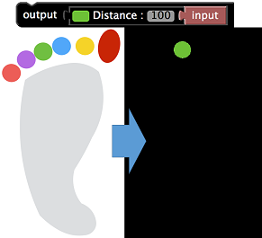
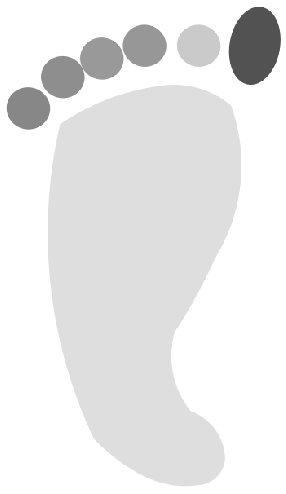
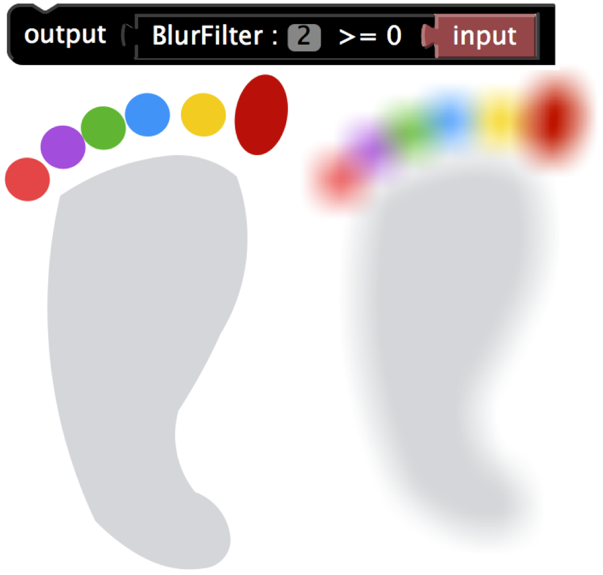

# UMATracker-FilterGenerator Block Reference

## I/O

## BGR Image

## Filters
### Color Filter Block

```eval_rst
.. list-table:: ColorFilter
    :header-rows: 1

    * - Block
      - Description
    * - .. image:: img/block_ref/uma_filtergenerator_colorfilter.png
      - 左のカラーパレットで色を選択し右の類似度（数値）を調整することで色を選択する．
```


```eval_rst
.. note:: ColorFilterブロックを選択後，『入力画面』上の抽出したい色の部分をクリックすることで色を選択することもできる．
.. note:: カラーパレットが表示されない場合は、インターネットに接続してください。
```

```eval_rst
.. youtube:: https://www.youtube.com/watch?v=3ktUtdCrQzk
```
### GrayScale Filter Block

```eval_rst
.. list-table:: ColorFilter
    :header-rows: 1

    * - Block
      - Description
	* - .. image:: img/block_ref/uma_filtergenerator_bgrtogray.png
	  - カラー画像をGrayScale画像に変換する。

```



### Threshold Filter Block

```eval_rst
.. list-table:: Threshold Filter
    :header-rows: 1

    * - Block
      - Description
	* - .. image:: img/block_ref/uma_filtergenerator_threshold.png
	  - GrayScale画像を色の明暗によって白黒画像に変換する。明暗の度合いは右側の数値を変更できる。

```


### Blur Filter Block

```eval_rst
.. list-table:: Blur Filter
    :header-rows: 1

    * - Block
      - Description
	* - .. image:: img/block_ref/uma_filtergenerator_blur.png
	  - 入力された画像をブロック右側の数値の程度によりぼかすフィルタ。

```



## Mask Image

## Operator

## Morphology

## Variables
