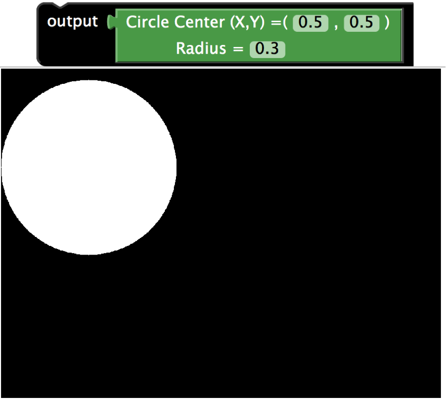
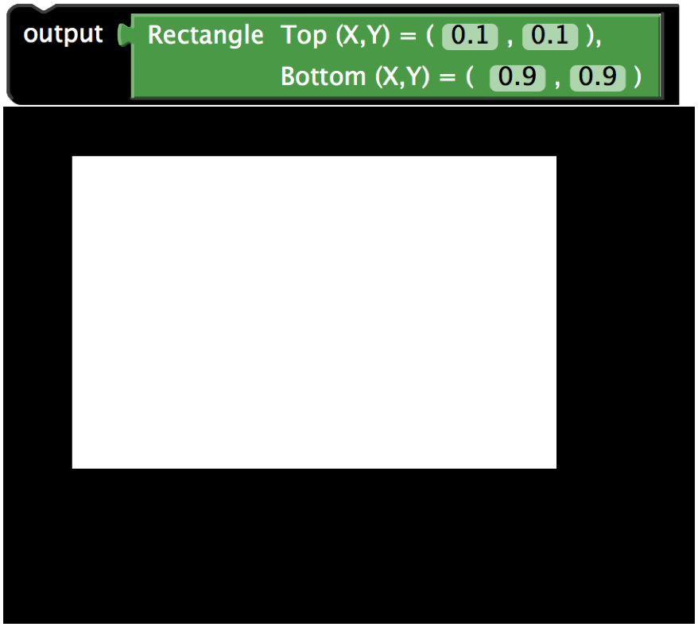
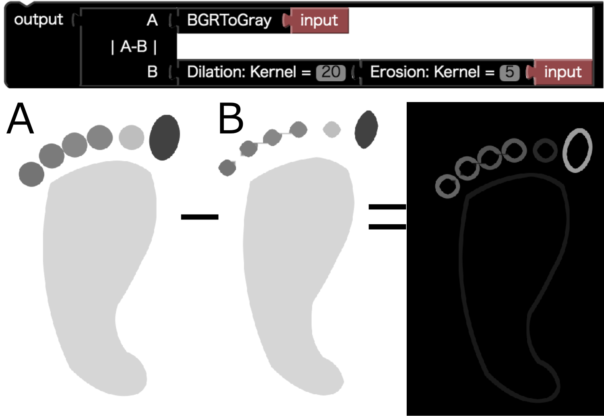
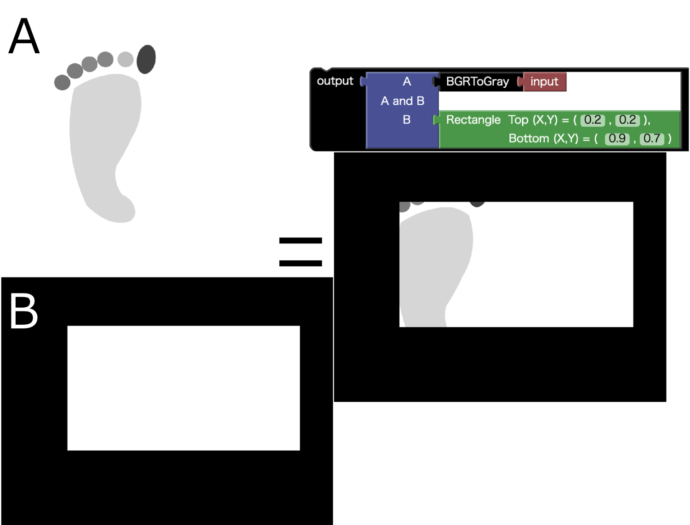
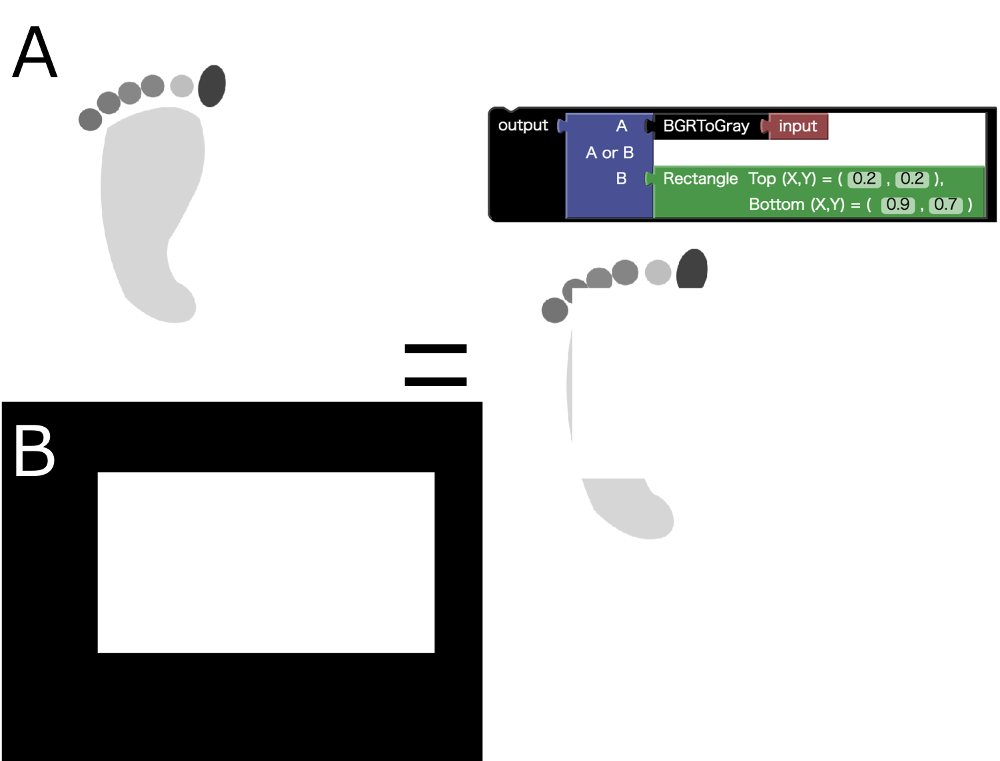
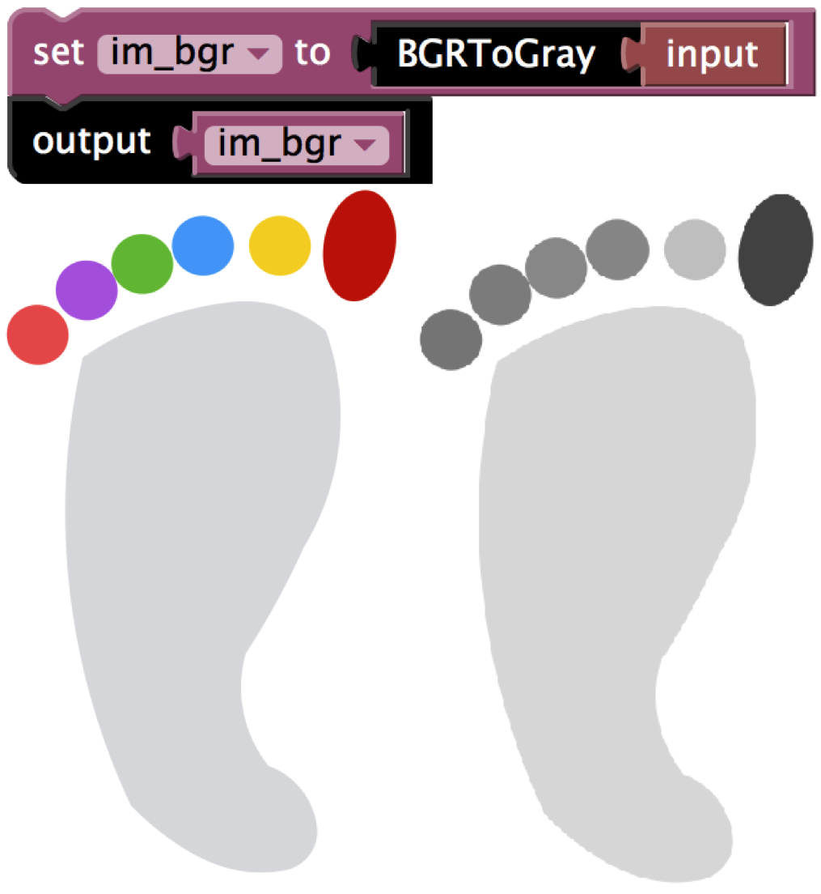

# UMATracker-FilterGenerator Block Reference

## I/O

### Input Block

```eval_rst
.. list-table:: Input Block
    :header-rows: 1

    * - Block
      - Description
    * - .. image:: img/block_ref/IO/uma_filtergenerator_input.png
      - FilterGeneratorに読み込ませた画像を出力する。動画であれば、現在表示中の1Frameの画像を出力する。
```

### Output Block

```eval_rst
.. list-table:: Output Block
    :header-rows: 1

    * - Block
      - Description
    * - .. image:: img/block_ref/IO/uma_filtergenerator_output.png
      - 入力された画像を、"フィルタを掛けた後の画像"へ出力する。
```


## BGR Image

## Filters
### Color Filter Block

```eval_rst
.. list-table:: ColorFilter
    :header-rows: 1

    * - Block
      - Description
    * - .. image:: img/block_ref/filter/uma_filtergenerator_colorfilter.png
      - 左のカラーパレットで色を選択し右の類似度（数値）を調整することで色を選択する．
```


```eval_rst
.. note:: ColorFilterブロックを選択後，『入力画面』上の抽出したい色の部分をクリックすることで色を選択することもできる．
.. note:: カラーパレットが表示されない場合は、インターネットに接続してください。
```

```eval_rst
.. youtube:: https://www.youtube.com/watch?v=3ktUtdCrQzk
```
### GrayScale Filter Block

```eval_rst
.. list-table:: ColorFilter
    :header-rows: 1

    * - Block
      - Description
	* - .. image:: img/block_ref/filter/uma_filtergenerator_bgrtogray.png
	  - カラー画像をGrayScale画像に変換する。

```


```eval_rst
.. youtube:: https://www.youtube.com/watch?v=PWU-oIr0-w0
```

### Threshold Filter Block

```eval_rst
.. list-table:: Threshold Filter
    :header-rows: 1

    * - Block
      - Description
	* - .. image:: img/block_ref/filter/uma_filtergenerator_threshold.png
	  - GrayScale画像を色の明暗によって白黒画像に変換する。明暗の度合いは右側の数値を変更できる。

```

```eval_rst
.. youtube:: https://www.youtube.com/watch?v=Z86yvoGQwNA
```

### ColorInverse Filter Block

```eval_rst
.. list-table:: ColorInverse Filter
    :header-rows: 1

    * - Block
      - Description
	* - .. image:: img/block_ref/filter/uma_filtergenerator_colorInverse.png
	  - GrayScale画像が入力された場合、白色に近い色は、黒色に近い色に変化し、黒色に近い色は、白色に近い色に変換される。
```

```eval_rst
.. youtube:: https://www.youtube.com/watch?v=_r1P25_Skcc
```


### Blur Filter Block

```eval_rst
.. list-table:: Blur Filter
    :header-rows: 1

    * - Block
      - Description
	* - .. image:: img/block_ref/filter/uma_filtergenerator_blur.png
	  - 入力された画像をブロック右側の数値の程度によりぼかすフィルタ。

```


### Median Filter Block

```eval_rst
.. list-table:: Median Filter
    :header-rows: 1

    * - Block
      - Description
	* - .. image:: img/block_ref/filter/uma_filtergenerator_median.png
	  - 入力された画像をブロック右側の数値の程度によりぼかすフィルタ。

```


### CircleSelection Filter Block

```eval_rst
.. list-table:: CircleSelection Filter
    :header-rows: 1

    * - Block
      - Description
	* - .. image:: img/block_ref/filter/uma_filtergenerator_ellipseRegionSelectoion.png
      - 入力された画像を円形にトリミングする。

```

```eval_rst
.. youtube:: https://www.youtube.com/watch?v=fqht_bxmx3s
```


### RectangleSelection Filter Block

```eval_rst
.. list-table:: RectangleSelection Filter
    :header-rows: 1

    * - Block
      - Description
	* - .. image:: img/block_ref/filter/uma_filtergenerator_rectangle.png
	  - 入力された画像を四角形にトリミングする。

```

```eval_rst
.. youtube:: https://www.youtube.com/watch?v=NRFRUSzR6xk
```

### PolySelection Filter Block

```eval_rst
.. list-table:: PolySelection Filter
    :header-rows: 1

    * - Block
      - Description
	* - .. image:: img/block_ref/filter/uma_filtergenerator_poly.png
	  - 入力された画像を任意の形にトリミングする。 <---- 任意ではない(修正

```


## Mask Image
### Circle Mask Block

```eval_rst
.. list-table:: CircleMaskBlock
    :header-rows: 1

    * - Block
      - Description
	* - .. image:: img/block_ref/mask/uma_filtergenerator_circle.png
	  - 白い円形の画像を出力するブロック

```


### Rectangle Mask Block

```eval_rst
.. list-table:: RectangleMaskBlock
    :header-rows: 1

    * - Block
      - Description
	* - .. image:: img/block_ref/mask/uma_filtergenerator_rectangle.png
	  - 白い四角形の画像を出力するブロック

```



## Operator
### AbsDiff Block

```eval_rst
.. list-table:: AbsDiff Block
    :header-rows: 1

    * - Block
      - Description
	* - .. image:: img/block_ref/operator/uma_filtergenerator_absdiff.png
	  - 二つの画像を入力すると、その差が出力される。

```



### And Block

```eval_rst
.. list-table:: And Block
    :header-rows: 1

    * - Block
      - Description
	* - .. image:: img/block_ref/operator/uma_filtergenerator_and.png
	  - 二つの画像に対しAndを計算し出力する

```


### Or Block

```eval_rst
.. list-table:: Or Block
    :header-rows: 1

    * - Block
      - Description
	* - .. image:: img/block_ref/operator/uma_filtergenerator_or.png
	  - 二つの画像に対しOrを計算し出力する

```



## Morphology
### Erosion Filter Block

```eval_rst
.. list-table:: Erosion Filter
    :header-rows: 1

    * - Block
      - Description
	* - .. image:: img/block_ref/morphology/uma_filtergenerator_erosion.png
	  - それぞれの画素の周辺に白い画素があれば白色に置き換える。

```


### Dilation Filter Block

```eval_rst
.. list-table:: Dilation Filter
    :header-rows: 1

    * - Block
      - Description
	* - .. image:: img/block_ref/morphology/uma_filtergenerator_dilation.png
	  - それぞれの画素の周辺の画素と同じいろにそろえる

```


### Opening Filter Block

```eval_rst
.. list-table:: Opening Filter
    :header-rows: 1

    * - Block
      - Description
	* - .. image:: img/block_ref/morphology/uma_filtergenerator_opening.png
	  - AAA

```


### Closing Filter Block

```eval_rst
.. list-table:: Closing Filter
    :header-rows: 1

    * - Block
      - Description
	* - .. image:: img/block_ref/morphology/uma_filtergenerator_closing.png
	  - AAA

```


## Variables
### SetVariable Block

```eval_rst
.. list-table:: SetVariable Block
    :header-rows: 1

    * - Block
      - Description
	* - .. image:: img/block_ref/variables/uma_filtergenerator_setvariable.png
	  - 入力したブロックを変数に格納するブロック。変数の名前は左側のitemから変更できる。

```
### Closing Filter Block

```eval_rst
.. list-table:: Closing Filter
    :header-rows: 1

    * - Block
      - Description
	* - .. image:: img/block_ref/variables/uma_filtergenerator_out.png
	  - 格納した変数を出力するブロック。どの変数にするかは変更可能。

```

