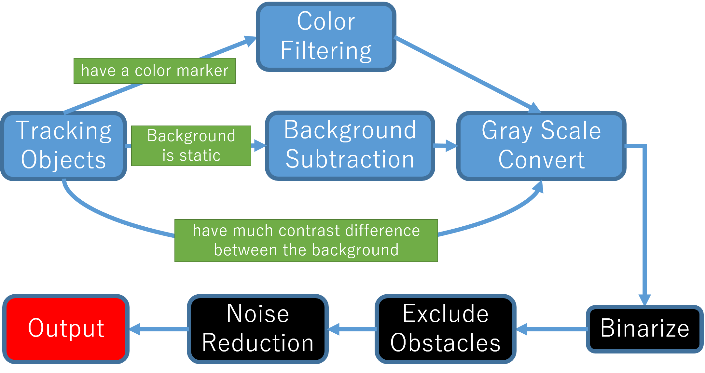

# UMATracker Quick Start Guide
## Summary
**UMATracker**は個体追跡，およびその結果の解析を提供するソフトウェア群である．

**UMATracker**は,

* **UMATracker-FilterGenerator**
* **UMATracker-Tracking**
* **UMATracker-TrackingCorrector**
* **UMATracker-Area51**

という4つのソフトウェアに別れており，各ソフトウェアを組み合わせることで動画の前処理・個体追跡・結果の修正・結果の解析を行うことが出来る．

### UMATracker Can Do
* ブロックの組み合わせによる解析動画の下処理（**UMATracker-FilterGenerator**）．
* 追跡対象の個体数が常に一定なビデオを使った個体追跡（**UMATracker-Tracking**）．
* 追跡対象の骨格・形状・向きの推定（**UMATracker-Tracking**）．
* 個体追跡結果の修正（**UMATracker-TrackingCorrector**）．
* Region-Of-Interest・個体間インタラクションなど，追跡結果の解析（**UMATracker-Area51**）．

### UMATracker Cannot Do (Currently)
* 追跡対象の個体数が増減するビデオをつかった個体追跡．
* **UMATracker-FilterGenerator**による前処理によって追跡対象を抽出できない場合の個体追跡．
```eval_rst
.. note:: 現状出来ないことに関しても，プラグインを作成・使用することで対応可能となっている．本件に関してはプラグイン作成マニュアルで別途触れる．
```

本Quick Start Guideでは個体追跡に絞って使用方法を解説する．

## Workflow


**UMATracker**による個体追跡は,

1. **UMATracker-FilterGenerator**で動画の下処理のためのフィルタを作成し，
2. **UMATracker-Tracking**において**UMATracker-FilterGenerator**で作成したフィルタを用いて個体追跡を行い，
3. **UMATracker-TrackingCorrector**を使って，**UMATracker-Tracking**で得られた個体追跡結果を修正し，
4. **UMATracker-Area51**をもちいて追跡結果の解析を行う

という流れになっている．

## UMATracker-FilterGenerator
個体追跡を行いたい動画に対して前処理として画像フィルタをかけて個体の位置を抽出することで，個体追跡の精度を高めることが出来る．
そこでまず**UMATracker-FilterGenerator**を使用し，ブロックを組み合わせることで画像フィルタを作成する．

### FilterGenerator Window
以下に**UMATracker-FilterGenerator**の画面各部の名称および説明を示す．


1. フィルタツールチップ
	
	利用出来るブロックの一覧が表示されるツールチップ．入力画像を変化させる画像フィルタが各ブロックに割り当てらており，
	ブロックを組み合わせることで個体を抽出するような画像フィルタを作成する．

2. フィルタブロック
	
	このブロックをドラッグ・アンド・ドロップし，ブロックをつなぎ合わせることで個体を抽出する画像フィルタを作成する．

3. キャンバス
	
	フィルタブロックを配置し，フィルタ群を作成する場所．

4. 入力画面
	
	入力動画が表示される．

5. 出力画面
	
	入力した動画に対してキャンバスに設置したフィルタを適応した結果が表示される．

6. Background生成メニュー
	
	入力動画の背景を抽出し，除去する．

### Filter Block Operation
上述のキャンバス上でブロックを組み合わせることで，画像フィルタを作成する．
本節ではブロックの操作方法について説明する．
#### Initial Block State


起動時には`Output`ブロックと`Input`ブロックのみがキャンバス上に表示される．
`Input`はソフトウェアに読み込ませた動画像のことを指しており，上述の『入力画面』に表示されている動画像のことである．

そして，`Output`ブロックに接続されたブロックのデータが上述の『出力画面』に表示される．
この例では`Input`ブロックが`Output`ブロックに直接接続されているので，`Input`ブロックのデータ，すなわち『入力画面』に表示された動画像が
『出力画面』に表示される．
`Input`ブロックと`Output`ブロックの間に各フィルタを意味するブロックを複数挟み込むことで画像フィルタを表現することが出来る．

#### Add Block
キャンバス上のブロック群へブロックを追加するには，フィルタツールチップからブロックをドラック＆ドロップすればよい．


```eval_rst
.. note:: ドラッグ＆ドロップではなく，フィルタツールチップ上でフォーカス中に右クリックすることでもフィルタを追加することができる．
```

たとえばフィルタツールチップ`Filters`内の`BGRToGray`を追加すると，『出力画面』が『入力画面』のグレースケールへ変化する．
このことから`BGRToGray`がグレースケールフィルタを意味していることがわかる．


このとき入出力は，

1. 『入力画面』に表示された動画像が`Input`ブロックを通して，
2. `BGRToGray`ブロックに入力される．このブロックが入力されたデータをグレースケール動画像へ変換し，
3. 変換後の動画像が`Output`ブロックに入力される．
4. そして，`Output`ブロックに入力された動画像が『出力画面』に反映される．

という流れとなっている．

#### Remove Block
不要になったブロックを削除するには，『フィルタツールチップ』もしくは『キャンバス』上のゴミ箱へブロックをドラッグ＆ドロップすれば良い．

```eval_rst
.. warning:: Outputブロックとブロックが離れている場合，使われていないブロックがある場合にはエラーとなり，出力が『出力画面』に反映されなくなる．

    .. list-table:: Error Examples
        :header-rows: 1

        * - Blocks
          - Description
        * - .. image:: img/quick/uma_filtergenerator_disconnectedoutputblock.png
          - ブロックとブロックが離れている場合．
        * - .. image:: img/quick/uma_filtergenerator_unusedblock.png
          - 使われていないブロックがある場合．
```

#### Block Types
ブロックは入力/出力があるかで3種類にわけることができる．

**入力/出力ブロックには画像フィルタが割り当てられており，入力ブロックからの動画像をフィルタで変換したものを出力する．**

```eval_rst
.. list-table:: Block I/O Types
    :header-rows: 1

    * - Block Example
      - Type
      - Description
    * - .. image:: img/quick/uma_filtergenerator_inputonlyblock.png
      - 入力ブロック
      - 入力のみを受け付けるブロック．
    * - .. image:: img/quick/uma_filtergenerator_inputoutputblock.png
      - 入力/出力ブロック
      - 入力と出力の両方をそなえたブロック．
    * - .. image:: img/quick/uma_filtergenerator_outputonlyblock.png
      - 出力ブロック
      - 出力のみをもつブロック．
```

### How to Make your own Filter

**UMATracker-FilterGenerator**では，個体追跡したい物体の場所が白くなるフィルタを作成することが目標である．上図ではアリのいた場所のみ白くなっていることがわかる．
そのためには

1. グレースケール変換
2. 二値化
3. 解析に不要な領域の除去
4. ノイズ除去

という手順をふむ必要がある．




#### Open the Video File
メニューより`Files/Open Video File`を選択，もしくはビデオファイルをウインドウにドラッグアンドドロップすることで解析に使用するビデオを読み込む．

```eval_rst
.. warning:: ファイルサイズが大きい（GB単位），もしくは長時間のビデオ（15分以上）を読み込むとソフトウェアの動作が遅くなる場合がある．そのような時はビデオを扱う場合は事前にエンコード・動画の分割を行うと解決される．
```

#### Generate Background
メニューより`Background/Create Background`を選択すると，バックグラウンド生成画面が表示される．

#### Color Filtering
カラーマーカーが付いている場合など追跡物体が特徴的な色を有している場合，その色を抽出するフィルタを作成することで追跡物体を抽出することができる．

```eval_rst
.. list-table:: ColorFilter
    :header-rows: 1

    * - Block
      - Description
    * - .. image:: img/quick/uma_filtergenerator_colorfilter.png
      - 右のカラーパレットで色を選択し左の類似度（数値）を調整することで色を選択する．
```

`Color Filter`は`Filters`ツールチップに含まれている．
ブロック左の赤色の部分をクリックするとカラーパレットがひらき，抽出したい色を選択することができる．
ブロック右の数値入力欄は色の類似度を表しており，選択した色とどの程度類似した色を抽出するか調整可能となっている．


```eval_rst
.. note:: ColorFilterブロックを選択後，『入力画面』上の抽出したい色の部分をクリックすることで色を選択することもできる．
```

```eval_rst
.. youtube:: https://www.youtube.com/watch?v=3ktUtdCrQzk
```

#### Convert to Gray Scale
#### Binalize
#### Exclude the Obstacle by the Region Selector
#### Noise Reduction


#### Save Filter Data
メニューより`Files/Save Filter Data`を選択することでフィルタデータ（拡張子`.filter`）が保存される．
```eval_rst
.. warning:: Gray Scale変換・Binalizeを行っていない場合は個体追跡に失敗するので，保存前にGray Scale変換・Binalizeが行われていることを確認すること．
```